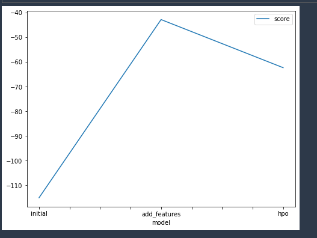
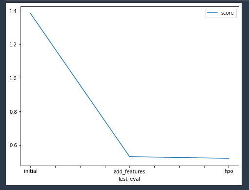

# Report: Predict Bike Sharing Demand with AutoGluon Solution
#### Raphael Blankson

## Initial Training
### What did you realize when you tried to submit your predictions? What changes were needed to the output of the predictor to submit your results?
The negative values were rejected. I converted the negative values (numbers less than 0) to 0

### What was the top ranked model that performed?
WeightedEnsemble_L3 performed better than all the models in all the experiments.

## Exploratory data analysis and feature creation
### What did the exploratory analysis find and how did you add additional features?
Exploratory data analysis revealed:
* The features working_day and holiday hold binary values
* The features weather and season are categorical values
* The features casual and registered should be ignored because they were not present in the test dataset.
* The feature Datetime is a datetime object thus I transformed it by splitting into different features -> day, month, hour, weekday

### How much better did your model perform after adding additional features and why do you think that is?
After adding features, the initial RMSE score of `1.38480` improved to become `0.53024`. One possible reason is that the new featurews are strongly correlated to the target.

## Hyper parameter tuning
### How much better did your model perform after trying different hyper parameters?
After trying different hyperparameters, the RMSE score of the model improved but not very significant compared with the model with the added features but very high compared to the initial model with default parameters.

### If you were given more time with this dataset, where do you think you would spend more time?
* I would perform more EDA to see if there might be additional features that can improve the model performance.
* I would finetune the hyperparameters and that may probably lead to a model with very high performance. eg. I could try bagging and ensembling which may increase training time but will highly improve performance.

### Create a table with the models you ran, the hyperparameters modified, and the kaggle score.
|model|num_epochs|num_boost_round|time|score|
|--|--|--|--|--|
|initial|default|default|600|1.38480|
|add_features|default|default|600|0.53024|
|hpo|10|100|600|0.52027|

### Create a line plot showing the top model score for the three (or more) training runs during the project.

TODO: Replace the image below with your own.

### Create a line plot showing the top kaggle score for the three (or more) prediction submissions during the project.

TODO: Replace the image below with your own.

## Summary
The aim of this task was to predict the bike sharing demand given historical data. It is a regression problem. I used AutoGluon framework to train several models for the task. I started with a model that only uses the default parameters as my base model. The performance wasn't so high. However after some Exploratory Data analysis, I assigned the category datatypes to certain columns and splitted the Datetime into different columns. This resulted in a better model than the initial model. I finetuned the model by tweaking some hyperparameters, howerver the outcome wasn't too high compared to the model after EDA. 
My final model had a score of 0.52.
