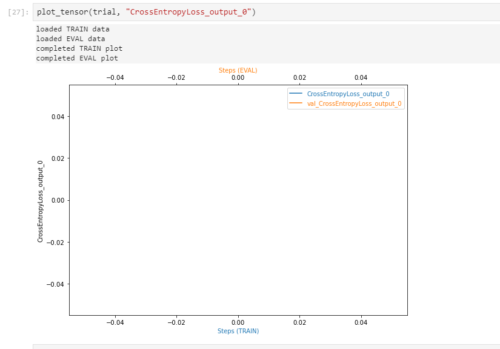

# Image Classification using AWS SageMaker

Use AWS Sagemaker to train a pretrained model that can perform image classification by using the Sagemaker profiling, debugger, hyperparameter tuning and other good ML engineering practices. This can be done on either the provided dog breed classication data set or one of your choice.

## Project Set Up and Installation
Enter AWS through the gateway in the course and open SageMaker Studio. 
Download the starter files.
Download/Make the dataset available. 

## Dataset
The provided dataset is the dogbreed classification dataset which can be found in the classroom.
The project is designed to be dataset independent so if there is a dataset that is more interesting or relevant to your work, you are welcome to use it to complete the project.

For this project I used the hymenoptera dataset which consists of 2 classes for ants and bees.

### Access
Upload the data to an S3 bucket through the AWS Gateway so that SageMaker has access to the data.

### Scripts
1. `hpo_Copy.py` -  for hyperparameter tuning jobs.
2. `train_model_copy.py` - used for training the model and making inference on the model.

## Hyperparameter Tuning
What kind of model did you choose for this experiment and why? Give an overview of the types of parameters and their ranges used for the hyperparameter search

I used Resnet18 pretrained model and a fully connected layer to classify ants and bees. 
I used learning rate(between `1e-4` and `1-e-1`) and batch_size of (`32 ` and `64)` for my hyperparameter tuning job and selected the best from the result of the tuning job.

 

The best hyperparameters from the training job is shown below:
<!-- Remember that your README should:
- Include a screenshot of completed training jobs
- Logs metrics during the training process
- Tune at least two hyperparameters
- Retrieve the best best hyperparameters from all your training jobs -->
 

## Debugging and Profiling
I set the debugger hook for recording the loss.
** On the first trial my graph plotted, but on second trial, the graph does not show (having issues with aws limits), I have attached image of both below:

first debug profile output
 

second trial output:
 

The loss decreased steadily and the graph is slightly smooth. Although this is a very small dataset, the ResNet18 model performed very well.

Check the profiler report for the profile report `profiler-report.html`, `profiler-report.ipynb`

### Results
The results was very good and training although was cpu instance ("ml.m5.2xlarge") was fast. It took 149 seconds to complete.
The best Accuracy on the test data is 95.45%.

## Model Deployment
Model was deployed on the "ml.m5.2xlarge" instance with best hyperparameters.  

## Using the Endpoint
First open the image (jpg format) of an ant or bee using PIL (pillow) library. Apply a transformation to the image, unsqueeze the image to add additional dimension to the first position [unsqueeze(dim=0)]. finally pass the unsqueezed image to the endpoint through estimator.predict function. This returns the result as an array with 2 elements which represents our classes - ants and bees. Use np.argmax to select the right class of the prediction.
The image below shows this process from the jupyter notebook:

